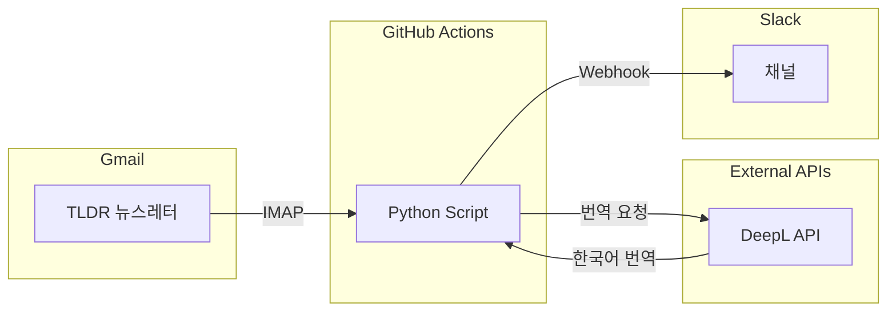

# TLDR Newsletter Translator

Gmail에서 TLDR 뉴스레터를 자동으로 가져와 한국어로 번역 후 Slack으로 발송하는 자동화 도구입니다.

## 아키텍처



## 주요 기능

- **자동 번역**: TLDR 뉴스레터의 기사 제목과 요약을 한국어로 번역
- **매일 자동 실행**: GitHub Actions를 통해 매일 오전 9시(KST) 자동 실행
- **Slack 발송**: 번역된 뉴스를 보기 좋은 형식으로 Slack에 전송
- **중복 방지**: 당일 이메일만 처리하여 중복 발송 방지
- **자동 정리**: 30일 지난 TLDR 이메일 자동 삭제

## 지원하는 TLDR 뉴스레터

| 뉴스레터 | 이모지 |
|---------|--------|
| TLDR | 📬 |
| TLDR AI | 🤖 |
| TLDR InfoSec | 🔐 |
| TLDR Crypto | ₿ |
| TLDR Founders | 🚀 |
| TLDR Design | 🎨 |
| TLDR Marketing | 📈 |
| TLDR DevOps | ⚙️ |
| TLDR Web | 🌐 |

## 설정 방법

### 1. Gmail 앱 비밀번호 생성

1. [Google 계정 보안](https://myaccount.google.com/security) 접속
2. 2단계 인증 활성화 (필수)
3. **앱 비밀번호** 생성
4. 앱: "메일", 기기: "기타" 선택
5. 생성된 16자리 비밀번호 저장

### 2. Slack Webhook URL 생성

1. [Slack API](https://api.slack.com/apps) 접속
2. **Create New App** → **From scratch**
3. **Incoming Webhooks** 활성화
4. **Add New Webhook to Workspace** 클릭
5. 채널 선택 후 Webhook URL 복사

### 3. DeepL API 키 발급

1. [DeepL API](https://www.deepl.com/pro-api) 가입
2. 계정에서 API 키 확인

### 4. GitHub Secrets 설정

저장소의 **Settings** → **Secrets and variables** → **Actions**에서 다음 시크릿 추가:

| Secret 이름 | 설명 |
|------------|------|
| `GMAIL_ADDRESS` | Gmail 주소 |
| `GMAIL_APP_PASSWORD` | Gmail 앱 비밀번호 (16자리) |
| `DEEPL_API_KEY` | DeepL API 키 |
| `SLACK_WEBHOOK_URL` | Slack Webhook URL |

## 실행 방법

### 자동 실행
- 매일 오전 9시(KST)에 GitHub Actions가 자동으로 실행됩니다.

### 수동 실행
1. GitHub 저장소의 **Actions** 탭 이동
2. **TLDR Translator** 워크플로우 선택
3. **Run workflow** 버튼 클릭

## 로컬 테스트

```bash
# 환경 변수 설정
export GMAIL_ADDRESS="your-email@gmail.com"
export GMAIL_APP_PASSWORD="your-app-password"
export DEEPL_API_KEY="your-deepl-key"
export SLACK_WEBHOOK_URL="your-slack-webhook-url"

# 실행
python tldr_translator.py
```

## 라이선스

MIT License - 자유롭게 사용, 수정, 배포 가능합니다.
